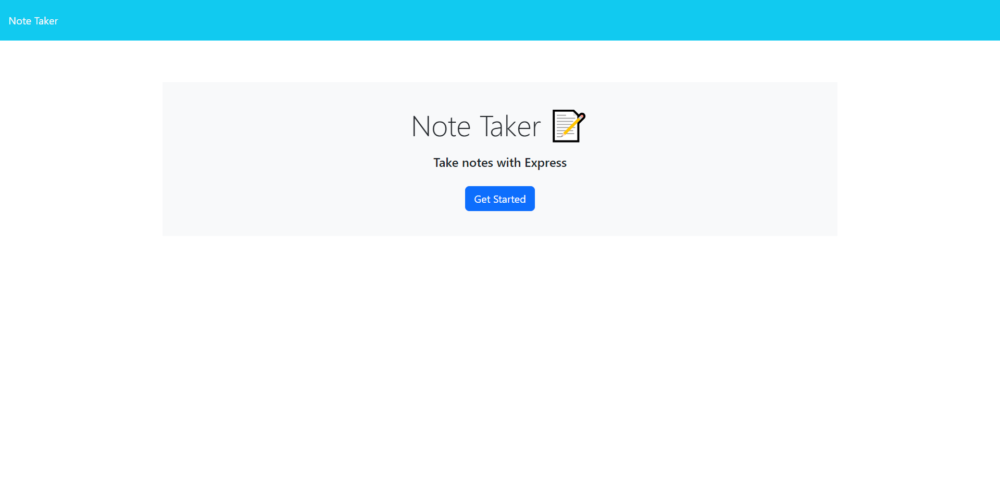
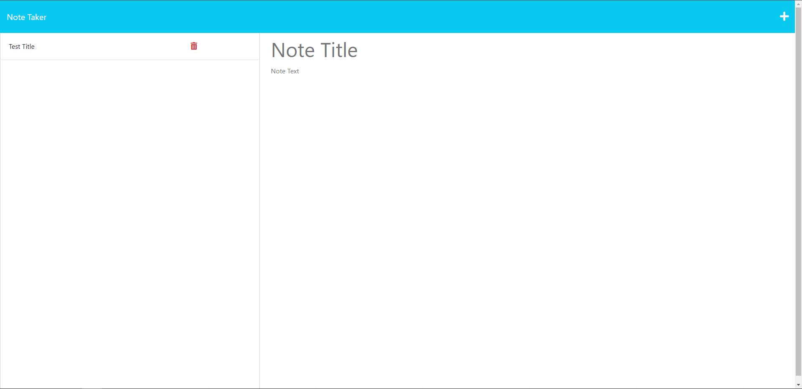

# Note-Taker

## Description
A simple application made with express.js to be able to write notes, store notes & delete notes.

## Table of Contents
1. [Installation](#installation)
2. [Usage](#usage)
3. [License](#license)
4. [Deployed Application](#deployed-application)
5. [Screenshots](#screenshots)
6. [Questions](#questions)

## Installation
To install the necessary dependencies, run the following command:
npm i

## Usage
After all the packages have been installed run the 'node server.js" command in the terminal after right-clicking on the server.js file. The server will then start to run which you can find by typing localhost:3001 into your browser. After pressing 'Get Started', type in your desired Note Title & Note Text into the website. The trash can icon deletes previous notes. The plus symbol creates a new note entirely & the floppy disk icon saves the note.

## License 
This project is licensed under the MIT license.

## Deployed-Application

https://unique-note-taker-application-48e175126b8f.herokuapp.com/

## Screenshots

## Questions
If you have any questions about this repo, open an issue or contact me directly at [samuelkininmonth@hotmail.com](mailto:samuelkininmonth@hotmail.com). You can find more of my work at [duragmyreligion](https://www.github.com/duragmyreligion).
